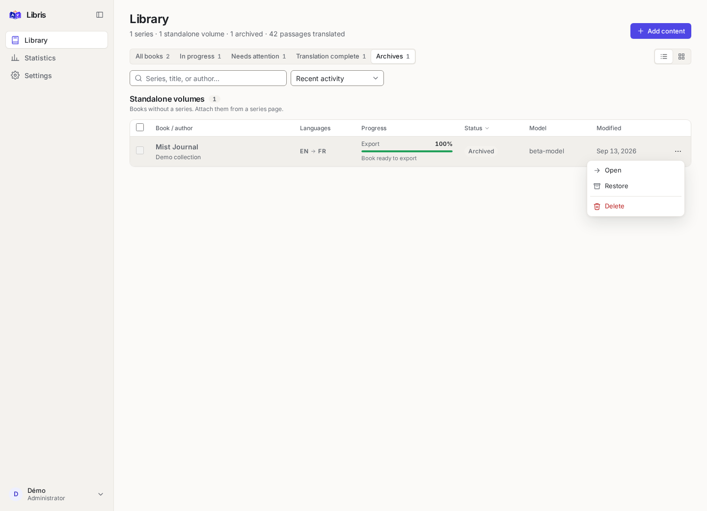
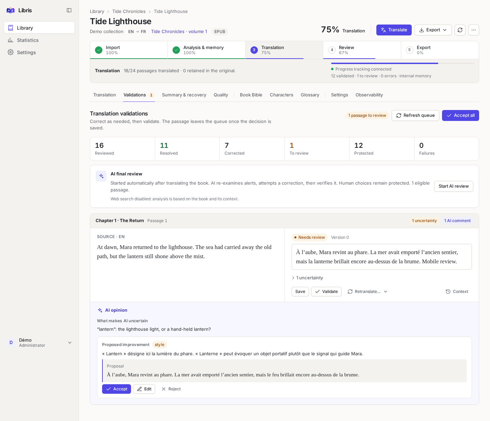
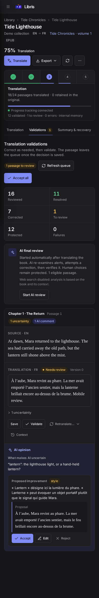

# Libris

[](https://github.com/HeartBtz/Libris/actions/workflows/tests.yml)
[](LICENSE)
[](https://hub.docker.com/r/heartbtz/libris)

<p align="center">
  
</p>

**A self-hosted library for literary translation — series, volumes and chapters, from the first chapter to the final review.**

Libris organises your translation work as a library of series. A series holds numbered volumes (EPUB books) or a continuous flow of webnovel chapters (TXT files, one per chapter), and automation clients can send volumes as JSON through a versioned API. Every volume goes through the same persistent pipeline — analysis, contextual translation, review, human validation, export — with a Book Bible per volume, a Series Bible, shared characters and a two-level glossary. Bring your own local or hosted language model. Your books and translation history stay on your server; selected content is sent to the providers you configure.

[Install](#quick-start) · [Docker guide](docs/docker.md) · [Deployment guide](docs/installation.md) · [Guide français](docs/user-guide.fr.md) · [Codex](docs/codex.md) · [Contributing](CONTRIBUTING.md)

## A workspace for long-form translation


The interface is a calm, dense editorial workspace: a collapsible sidebar, a warm
paper light theme and a neutral graphite dark theme (following the system by
default), a single indigo accent, Inter for the interface and a book serif for the
text being translated. Formatting codes are shown as formatting, never as raw
markers, and every screen works from phone to wide desktop.

- **Series, volumes and chapters:** the library shows series first, then standalone volumes. A guided import (**Add content** · *Ajouter du contenu*) inspects the files before anything is created, proposes the series and the volume or chapter numbers from the whole batch (`Vol. 2`, `Tome IV`, `v03`, `#04`, `[05]`, `Chapter 012`…), lets you correct them, and refuses ambiguous or duplicate numbers.
- **Three sources:** EPUB books (one volume each, or explicitly a standalone volume), TXT chapters of a webnovel (UTF-8, UTF-8/UTF-16 with BOM, flagged Windows-1252; layout kept; chapters added later without retranslating the others), and JSON content sent by the [automation API](docs/api.md) with API tokens, scopes, idempotency and asynchronous results.
- **Series memory:** characters, aliases, places, relations and terms known from earlier volumes are reused by the next ones, never the other way round; ambiguous identities are proposed, merged or split only by you; a volume can deliberately override a series term, and the decision is audited.
- **Consistent context:** book bible, character identities, relationships and a lockable glossary.
- **Your provider:** OpenAI-compatible APIs, OpenAI Responses, the native Anthropic and OpenAI APIs, or optional Codex/ChatGPT authentication.
- **Independent concurrency:** each provider has its own limit, shared by analysis, translation and review jobs.
- **Resumable work:** persistent jobs, checkpoints, pause/resume and retries after temporary failures.
- **Human decisions:** compare source and translation, accept or reject AI suggestions, edit and keep version history.
- **Final AI review:** automatically revisit flagged translations, attempt one verified correction and leave only unresolved items for review. Optional SearXNG terminology lookup; see [final review](docs/final-review.md).
- **Refusal recovery:** after two translation refusals, continue the book and retry refused passages later with a chosen provider.
- **Failure isolation:** an invalid response is asked again with the reason for its rejection; after three of them, try checkpointed small-batch repair before skipping the passage; stop after ten consecutive failed passages. See [recovery](docs/recovery.md).
- **Completion report:** see missing passages and remaining alerts, select failed passages and retry them with a chosen provider from **Bilan & récupération**.
- **Series pages:** a dashboard per series with its ordered volumes, webnovel chapters, Series Bible, series glossary, characters and relations, external memory backlog, defaults and archives; missing or duplicate volume numbers are shown, and every volume still opens in the translation workspace.
- **Interface locale:** French and English catalogs, persistent language choice, and locale-aware date, number, sorting, and status formatting. New interface text is added through `frontend/src/i18n.tsx`.
- **Reversible archives:** hide inactive projects without deleting their EPUB, translations, memory or history; restore them from the Archives view.
- **EPUB preservation:** preserve resources and inline structure, with EPUBCheck validation on export.
- **Optional external memory:** use internal SQL memory alone, or connect your own OpenViking instance, organised per series and rebuildable from PostgreSQL at any time ([OpenViking guide](docs/openviking.md)).
- **Exports per format:** EPUB for EPUB volumes (EPUBCheck-validated), one UTF-8 file per chapter in a ZIP with a checksum manifest, a consolidated text with chapter headings, Markdown, the Book Bible and a full project archive.

### Review with context


### Read and edit side by side


### Follow every stage


<details>
<summary>Mobile library</summary>


</details>

<details>
<summary>Series metadata and reversible archives</summary>




</details>

_Screenshots are generated by `frontend/e2e/showcase.spec.ts` from fictional data; they
do not represent translation quality benchmarks or expose a user's books or credentials._

### Navigating Libris

The library lists series, then standalone volumes, with search, activity filters and sorting;
**Add content** opens the guided import; actions on several volumes sit in a floating bar.
Inside a book, one highlighted button always shows the next step (configure, analyze,
recover, translate, review, export), a thin stepper follows the five stages, and tabs
lead to translation, validations, recovery, quality, Book Bible, characters, glossary,
settings and observability. Paid operations show the server's token and cost estimate
before they start, and edited passages are protected: leaving a tab or the page with
an unsaved translation asks first.

In the editor, `Ctrl`/`⌘`+`S` saves the focused passage and `Ctrl`/`⌘`+`Enter` validates
it. Keyboard users can skip directly to the main content, see a visible focus ring
everywhere, and keep focus when dialogs open and close; the character graph's links are
also listed as buttons. Phone controls provide at least 40 px touch targets, and
non-essential motion follows the reduced-motion preference.

<details>
<summary>Light theme and mobile review</summary>





</details>

## Quick start

### Requirements

- Linux AMD64 server or workstation with Docker Engine and Docker Compose v2.
- Git to obtain the Compose file and maintenance scripts.
- An accessible language-model provider. **No GPU is required on the Libris server** when inference runs elsewhere.
- Internet access to pull the published application, PostgreSQL and optional setup image.

Clone the public mirror and run the idempotent Docker installer:

```bash
git clone https://github.com/HeartBtz/Libris.git
cd Libris
./scripts/install-docker.sh
```

It creates a secret `.env` when needed, pulls the pinned `heartbtz/libris:0.5.0`
image and waits for the complete stack. It does not overwrite existing configuration or
delete persistent volumes. Python is optional; when absent, setup runs in a temporary
official Python container.

For routine application updates, avoid interrupting long inference jobs:

```bash
# Frontend/API change only: keep the current worker process running.
scripts/deploy.sh --api-only

# Worker change: wait up to 10 minutes for a clean idle boundary.
scripts/deploy.sh --worker-when-idle
```

`--force-worker` is reserved for resumable fixes that must be deployed immediately. Persistent checkpoints prevent completed segments from being repeated, but the requests interrupted in flight (several per book when its provider allows parallel calls) are audited and may be retried.

Open **http://localhost:8088** on the Docker host. The initial username is `admin`; find the generated password in the local `.env` under `BOOTSTRAP_PASSWORD`.

For a remote server, use an SSH tunnel first:

```bash
ssh -L 8088:127.0.0.1:8088 your-user@your-server
```

Then open http://localhost:8088 on your computer. For LAN, HTTPS, updates, backups and troubleshooting, follow the [Docker guide](docs/docker.md). The default binds only to loopback.

### Translate your first book

1. Open **Settings / Paramètres → Providers LLM** and add your endpoint, model and credentials.
2. Click **Add content**, choose EPUB or TXT, then a series (existing or new) or, for an EPUB, **Standalone volume**. Only import content you have the rights to translate.
3. Check the proposed titles and numbers, choose the provider, languages and quality mode (select **internal** memory to start without any external service), and import — with or without starting the analysis.
4. Analyze, review the Book Bible, the Series Bible and the glossaries, then start translation.
5. Use **Validations** to resolve flagged passages and **Traduction** to edit.
6. Export EPUB, the chapters as TXT files, a consolidated text, Markdown, the Book Bible (JSON) or a project archive.

The UI is available in French and English. Model quality, language coverage, latency and costs depend on your chosen provider. Structural validation is not a guarantee of literary fidelity.

## Supported environments

The officially supported deployment is **Docker Compose v2 on Linux/amd64**, tested with Python 3.13, Node.js 22 and PostgreSQL 17 through the supplied containers. Ubuntu and Debian hosts are expected to work when they run a supported Docker Engine, but host distributions are not tested independently. Windows, macOS, WSL and ARM64 are not currently verified.

See the [compatibility matrix](docs/compatibility.md) for the distinction between verified, conditional, untested and unsupported environments.

## Deployment and maintenance

See the [Docker guide](docs/docker.md) for a beginner-oriented walkthrough and [installation and operations](docs/installation.md) for advanced configuration. PostgreSQL and the Codex bridge are internal services; only the web application has a published port.

```bash
docker compose ps
curl --fail http://127.0.0.1:8088/health
```

Never delete persistent volumes during an update. Back up PostgreSQL, book storage and `.env` together; losing `SECRET_KEY` prevents decryption of saved provider credentials.

## Architecture

```text
Browser ─────────────┐
Automation (API v1) ─┴→ FastAPI → PostgreSQL (series, volumes, chapters, jobs, versions, memory)
                          ├── source adapters (EPUB, TXT, JSON) → the same chapters and passages
                          └── DATA_DIR (EPUB books, TXT/JSON sources, import staging)
Worker → configured model providers
       → optional OpenViking (one space per series, rebuilt from SQL)
       → optional private Codex bridge
```

React + TypeScript · FastAPI · PostgreSQL · Python worker · Docker Compose · EbookLib/lxml · EPUBCheck

| Directory       | Purpose                                                   |
| --------------- | --------------------------------------------------------- |
| `frontend/`     | Web interface, browser tests and screenshot fixtures      |
| `backend/`      | API, worker, migrations and tests                         |
| `prompts/`      | Versioned model instructions                              |
| `codex_bridge/` | Optional isolated Codex transport                         |
| `scripts/`      | Setup and integration-test utilities                      |
| `docs/`         | Installation, architecture, quality and operations guides |

## Development

```bash
python3 -m venv .venv
.venv/bin/pip install -r backend/requirements.lock
.venv/bin/pip install -e './backend[test]'
(cd backend && ../.venv/bin/pytest -q && ../.venv/bin/ruff check app tests)
npm --prefix frontend ci
npm --prefix frontend run build
```

GitLab is the canonical CI/release pipeline; the public GitHub mirror repeats release verification and publishes GHCR images. Live integration tests must use a disposable installation; see [Contributing](CONTRIBUTING.md).

Useful commands:

```bash
python3 scripts/check_version.py
python3 scripts/check_installation.py  # disposable Compose installation
docker compose logs --since=5m api worker
```

## Documentation

- [Installation, configuration, updates, backup and removal](docs/installation.md)
- [Docker deployment for beginners](docs/docker.md)
- [GitLab CI/CD, Docker registries and GitHub mirror](docs/ci-cd.md)
- [Architecture](docs/architecture.md) and [data model](docs/data-model.md)
- [Automation API (JSON, tokens, curl examples)](docs/api.md)
- [OpenViking external memory](docs/openviking.md)
- [Compatibility matrix](docs/compatibility.md)
- [Operations](docs/operations.md)
- [Scheduled backup and restore](docs/backup.md)
- [Recovery and resumable jobs](docs/recovery.md)
- [Security audit](docs/security-audit.md)
- [Release process](docs/release.md)
- [French user guide](docs/user-guide.fr.md)
- [Support](SUPPORT.md) and [contributing](CONTRIBUTING.md)

## Project status and publication

Libris follows Semantic Versioning and is currently an early-stage `0.x` application. See [CHANGELOG.md](CHANGELOG.md), the [release process](docs/release.md), the [quality evaluation protocol](docs/quality-evaluation.md) and [architecture](docs/architecture.md) for limitations. Report security issues privately following [SECURITY.md](SECURITY.md).

Licensed under **GNU AGPL-3.0-only**. See [LICENSE](LICENSE). If you modify Libris and offer it over a network, provide those users access to the corresponding source code under the license's terms. Dependency licenses and the rights to imported books remain separate. See [third-party notices](THIRD_PARTY_NOTICES.md).
