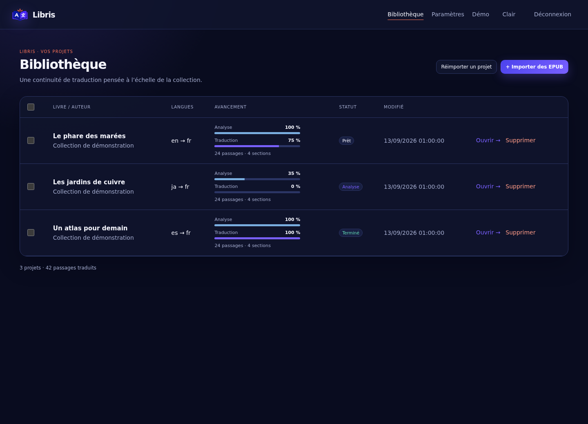
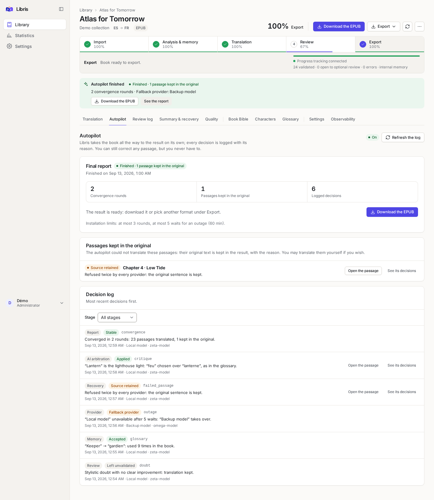
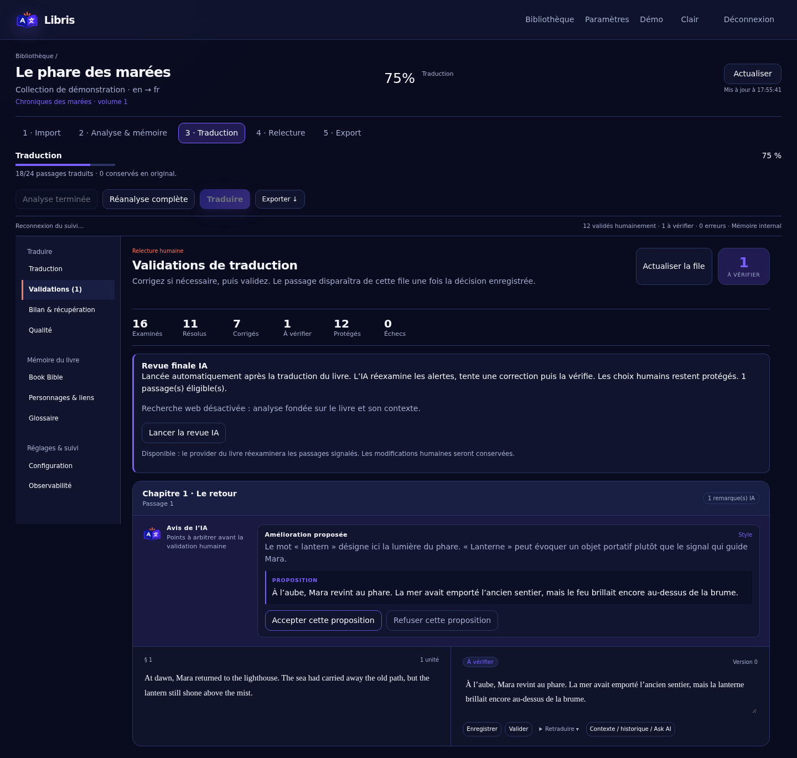
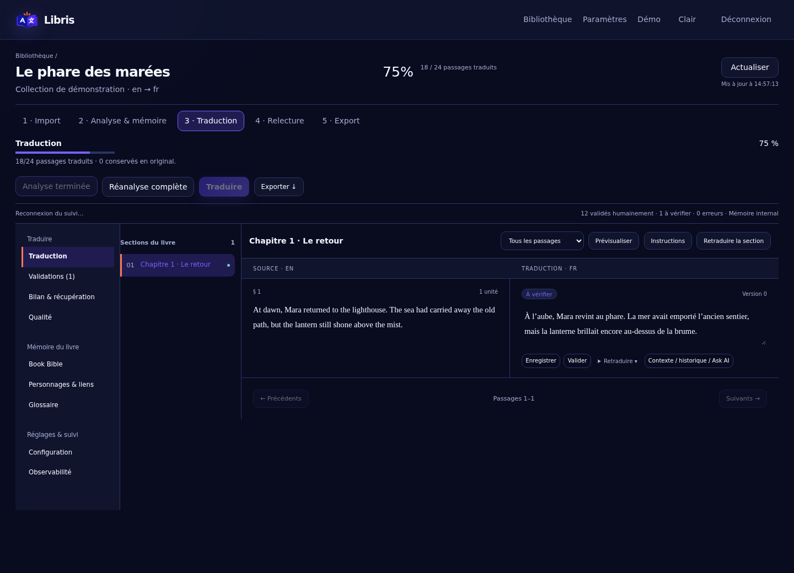

# Libris

[](https://github.com/HeartBtz/Libris/actions/workflows/tests.yml)
[](LICENSE)
[](https://hub.docker.com/r/heartbtz/libris)

<p align="center">
  
</p>

**Self-hosted literary translation for whole books and long series.**

Website: **[libris-translate.com](https://libris-translate.com/)** ([en français](https://libris-translate.com/fr/))

Libris turns an EPUB, a folder of webnovel chapters or a JSON payload into a translated book, using the
language model you choose. It reads the book first, builds a memory of its characters, places and terms, and
keeps that memory across the volumes of a series, so that a name translated in volume 1 is still the same in
volume 7. An autopilot takes each book from import to a downloadable result with no step for you to validate;
you can still read, correct and lock anything you like, and your corrections always win.

Your books and translations stay on your server. Only the passages being processed are sent to the model
providers you configure.



## What it does

- **A library of series.** Series hold numbered volumes or a continuous flow of chapters. A guided import
  inspects your files first, proposes the series and the volume or chapter numbers, and creates nothing until
  you confirm.
- **Many sources, faithful output.** EPUB 2 and 3, TXT chapters, Markdown, HTML and DOCX chapters, and JSON sent
  through the automation API. EPUB layout, styles and resources are preserved and the result is checked with
  EPUBCheck; text exports keep the chapter layout.
- **Context that carries over.** A Book Bible per volume, a Series Bible, character identities and relations,
  and a two-level glossary. A volume only learns from the volumes before it, never from later ones.
- **An autopilot.** Analysis, translation, review, a final AI review and AI arbitration run on their own. If a
  provider fails, Libris waits, retries and switches to fallback providers; a passage nobody could translate
  keeps its original text, with the reason written in the report.
- **You stay in control.** Compare source and translation side by side, edit with version history, accept or
  refuse AI suggestions, lock terms, and see every decision the autopilot made.
- **Your model, your costs.** OpenAI-compatible servers (local or hosted), the OpenAI and Anthropic APIs, and an
  optional Codex/ChatGPT connection. Each provider has its own concurrency limit and prices, and paid operations
  show a token and cost estimate before they start.
- **Built to run for days.** Persistent jobs with checkpoints survive restarts; pause, resume and retry never
  lose finished work.
- **Automation.** A versioned REST API with scoped tokens, idempotent requests and signed webhooks.
- **French and English interface**, light and dark themes, usable from phone to wide screen.

| Autopilot report | Review log | Side-by-side editor |
| --- | --- | --- |
|  |  |  |

_Screenshots are generated from fictional books by `frontend/e2e/showcase.spec.ts`._

## Quick start

You need a Linux (amd64) machine with Docker Engine and Docker Compose v2, Git, and access to a language model.
No GPU is needed on the Libris server when the model runs elsewhere.

```bash
git clone https://github.com/HeartBtz/Libris.git
cd Libris
./scripts/install-docker.sh
```

The installer creates a `.env` with generated secrets, pulls `heartbtz/libris:0.6.0` and starts the stack. It
never overwrites an existing configuration or deletes data.

Open **http://localhost:8088** on the same machine and sign in as `admin` with the `BOOTSTRAP_PASSWORD` written
in `.env`. On a remote server, open an SSH tunnel first (`ssh -L 8088:127.0.0.1:8088 you@your-server`); for LAN
or HTTPS access, follow the [Docker guide](docs/docker.md).

Then translate a first book:

1. **Settings → LLM providers** (*Paramètres → Providers LLM*): add your model's endpoint, model name and key.
2. **Add content** in the library: pick an EPUB or chapter files, choose a series, check the proposed numbers.
3. Choose the provider and languages, then **Import and run the whole pipeline**.
4. Follow the progress on the book page and download the result when it is ready.

Only import books you have the right to translate. Output quality, languages, speed and cost depend on the
model you use.

## Documentation

Everything else is in the [documentation index](docs/README.md): installation and configuration, day-to-day
operations and backups, how the autopilot works, the automation API, the architecture, and a complete
[user guide in French](docs/user-guide.fr.md).

## Contributing and support

Contributions are welcome: read [CONTRIBUTING.md](CONTRIBUTING.md) and [development.md](docs/development.md).
For help, see [SUPPORT.md](SUPPORT.md); report vulnerabilities privately as described in
[SECURITY.md](SECURITY.md). Changes are listed in [CHANGELOG.md](CHANGELOG.md).

## License

Libris is licensed under the **GNU AGPL-3.0-only** ([LICENSE](LICENSE)). If you modify it and let people use it
over a network, you must offer them the corresponding source. Third-party components keep their own licenses
([THIRD_PARTY_NOTICES.md](THIRD_PARTY_NOTICES.md)); the rights to the books you import are your responsibility.
