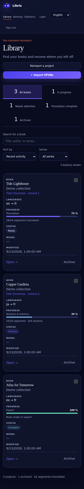

# Libris

<p align="center">
  
</p>

**Self-hosted, context-aware EPUB translation — from the first chapter to the final review.**

Libris combines a persistent translation pipeline with a book bible, character memory, a glossary and a human review workspace. Bring your own local or hosted language model. Your books and translation history stay on your server; selected content is sent to the providers you configure.

[Install](#quick-start) · [Deployment guide](docs/installation.md) · [Guide français](docs/user-guide.fr.md) · [Codex](docs/codex.md) · [Contributing](CONTRIBUTING.md)

## A workspace for long-form translation


- **Multiple books:** import EPUBs together and follow analysis and translation separately.
- **Consistent context:** book bible, character identities, relationships and a lockable glossary.
- **Your provider:** OpenAI-compatible APIs, OpenAI Responses, or optional Codex/ChatGPT authentication.
- **Independent concurrency:** each provider has its own limit, shared by analysis, translation and review jobs.
- **Resumable work:** persistent jobs, checkpoints, pause/resume and retries after temporary failures.
- **Human decisions:** compare source and translation, accept or reject AI suggestions, edit and keep version history.
- **Final AI review:** automatically revisit flagged translations, attempt one verified correction and leave only unresolved items for review. Optional SearXNG terminology lookup; see [final review](docs/final-review.md).
- **Refusal recovery:** after two translation refusals, continue the book and retry refused passages later with a chosen provider.
- **Failure isolation:** after five invalid responses, try checkpointed small-batch repair before skipping the passage; stop after ten consecutive failed passages. See [recovery](docs/recovery.md).
- **Completion report:** see missing passages and remaining alerts, select failed passages and retry them with a chosen provider from **Bilan & récupération**.
- **EPUB preservation:** preserve resources and inline structure, with EPUBCheck validation on export.
- **Optional external memory:** use internal SQL memory alone, or connect your own OpenViking instance.

### Review with context


### Read and edit side by side


<details>
<summary>Mobile library</summary>



</details>

_Screenshots use fictional, synthetic demonstration data in the real UI. They do not represent translation quality benchmarks or expose a user's books._

## Quick start

### Requirements

- Linux server or workstation with Docker Engine and Docker Compose v2.
- Python 3 to generate local configuration; Git to obtain the source.
- An accessible language-model provider. **No GPU is required on the Libris server** when inference runs elsewhere.
- Internet access during the image build to download dependencies and EPUBCheck.

Clone this repository using the HTTPS or SSH URL shown by your Git hosting service, then run from its root:

```bash
python3 scripts/setup.py
docker compose up -d --build --wait
```

Open **http://localhost:8088** on the Docker host. The initial username is `admin`; find the generated password in the local `.env` under `BOOTSTRAP_PASSWORD`. The setup script creates this file with restricted permissions and never overwrites an existing installation.

For a remote server, use an SSH tunnel first:

```bash
ssh -L 8088:127.0.0.1:8088 your-user@your-server
```

Then open http://localhost:8088 on your computer. For LAN or HTTPS access, follow the [deployment guide](docs/installation.md). The default binds only to loopback.

### Translate your first book

1. Open **Settings / Paramètres → Providers LLM** and add your endpoint, model and credentials.
2. Import an EPUB for which you have the necessary rights.
3. Choose the provider, languages and quality mode in the book's configuration. Select **internal** memory to start without any external service.
4. Analyze the book, review the book bible and glossary, then start translation.
5. Use **Validations** to resolve flagged passages and **Traduction** to edit.
6. Export EPUB, TXT, Markdown, JSON or a project archive.

The UI is currently in French. Model quality, language coverage, latency and costs depend on your chosen provider. Structural validation is not a guarantee of literary fidelity.

## Deployment and maintenance

See [installation and operations](docs/installation.md) for remote access, HTTPS, optional Codex, backups, updates and troubleshooting. PostgreSQL and the Codex bridge are internal services; only the web application has a published port.

```bash
docker compose ps
curl --fail http://127.0.0.1:8088/health
```

Never delete persistent volumes during an update. Back up PostgreSQL, book storage and `.env` together; losing `SECRET_KEY` prevents decryption of saved provider credentials.

## Architecture

```text
Browser → FastAPI → PostgreSQL (projects, jobs, versions, memory)
              └── book storage (EPUBs and exports)
Worker  → configured model providers
        → optional OpenViking
        → optional private Codex bridge
```

React + TypeScript · FastAPI · PostgreSQL · Python worker · Docker Compose · EbookLib/lxml · EPUBCheck

| Directory       | Purpose                                                   |
| --------------- | --------------------------------------------------------- |
| `frontend/`     | Web interface, browser tests and screenshot fixtures      |
| `backend/`      | API, worker, migrations and tests                         |
| `prompts/`      | Versioned model instructions                              |
| `codex_bridge/` | Optional isolated Codex transport                         |
| `scripts/`      | Setup and integration-test utilities                      |
| `docs/`         | Installation, architecture, quality and operations guides |

## Development

```bash
python3 -m venv .venv
.venv/bin/pip install -r backend/requirements.lock
.venv/bin/pip install -e './backend[test]'
(cd backend && ../.venv/bin/pytest -q && ../.venv/bin/ruff check app tests)
npm --prefix frontend ci
npm --prefix frontend run build
```

GitHub Actions and GitLab CI run backend tests and build the frontend. Live integration tests must use a disposable installation; see [Contributing](CONTRIBUTING.md).

## Project status and publication

Libris is an early-stage application. See the [quality evaluation protocol](docs/quality-evaluation.md) and [architecture](docs/architecture.md) for limitations. Report security issues privately following [SECURITY.md](SECURITY.md).

Licensed under **GNU AGPL-3.0-only**. See [LICENSE](LICENSE). If you modify Libris and offer it over a network, provide those users access to the corresponding source code under the license's terms. Dependency licenses and the rights to imported books remain separate. See [third-party notices](THIRD_PARTY_NOTICES.md).
