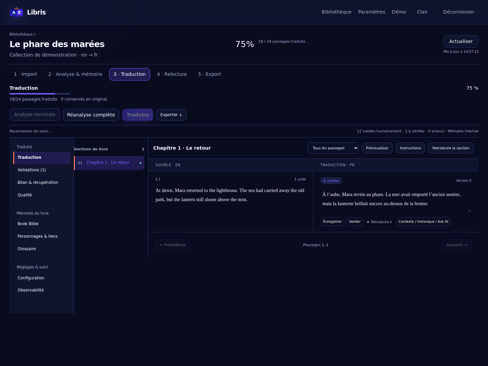
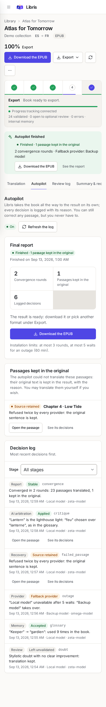
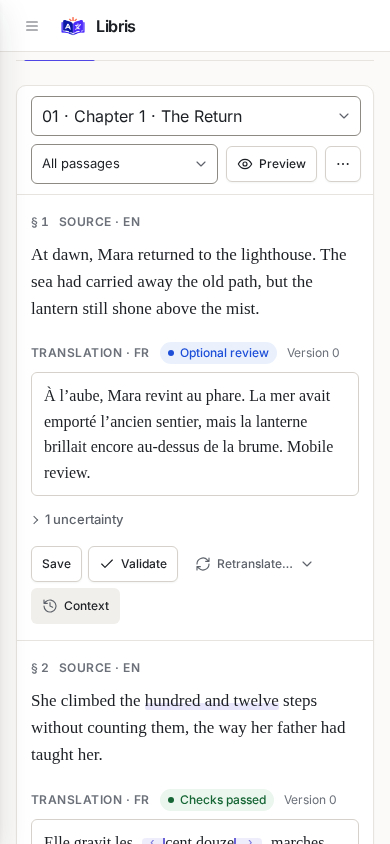
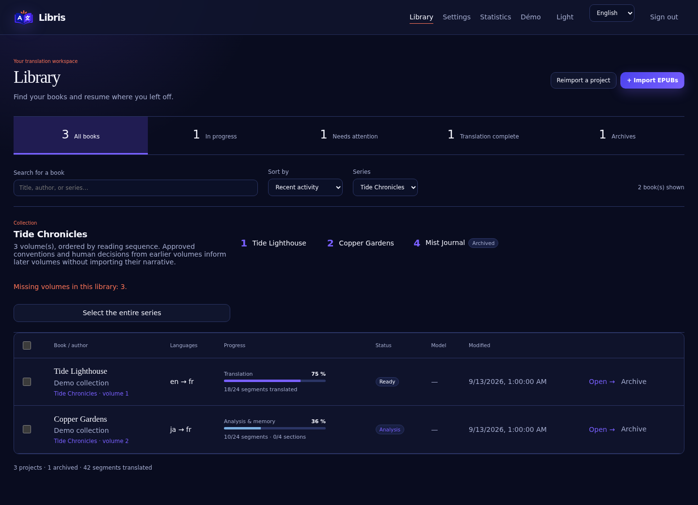
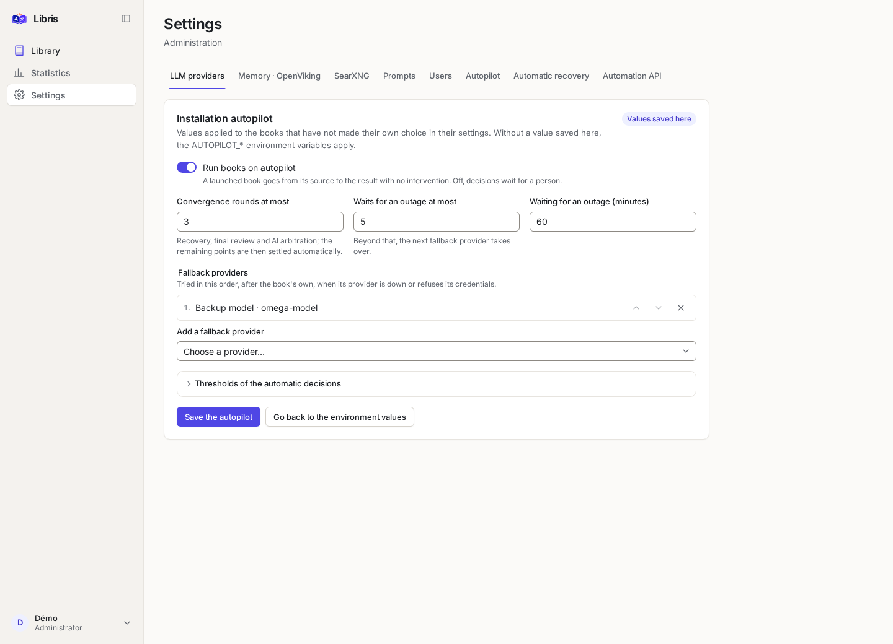

# Guide d’utilisation de Libris

Ce guide s’adresse à celles et ceux qui traduisent avec Libris au quotidien. Il suit l’interface écran par écran :
vous y apprendrez à ranger vos livres en séries, à importer des EPUB ou des chapitres, à laisser le pilote
automatique mener un livre jusqu’au résultat, à relire et corriger ce qui vous importe, puis à exporter. Les
dernières parties concernent les administrateurs (paramètres de l’installation) et les jetons d’API.

L’installation elle-même est décrite (en anglais) dans le [guide Docker](docker.md), et chaque réglage de
l’installation dans la [référence de configuration](configuration.md). L’interface existe en français et en
anglais ; les captures de ce guide montrent la version anglaise, les libellés cités sont ceux de la version
française.

## Sommaire

1. [Premiers pas](#premiers-pas)
2. [Votre premier livre en cinq minutes](#votre-premier-livre-en-cinq-minutes)
3. [La bibliothèque](#la-bibliothèque)
4. [Ajouter du contenu](#ajouter-du-contenu)
5. [La page d’un livre](#la-page-dun-livre)
6. [Le pilote automatique](#le-pilote-automatique)
7. [Traduire, relire et corriger](#traduire-relire-et-corriger)
8. [La mémoire du livre : Book Bible, personnages, glossaire](#la-mémoire-du-livre--book-bible-personnages-glossaire)
9. [Réglages d’un livre](#réglages-dun-livre)
10. [Exporter](#exporter)
11. [Les séries](#les-séries)
12. [Mon compte et les jetons d’API](#mon-compte-et-les-jetons-dapi)
13. [Paramètres de l’installation (administrateurs)](#paramètres-de-linstallation-administrateurs)
14. [Comprendre la traduction](#comprendre-la-traduction)
15. [Questions fréquentes](#questions-fréquentes)

## Premiers pas

### Se connecter

Ouvrez l’adresse de votre installation (par défaut <http://localhost:8088> sur la machine qui l’héberge). Au tout
premier accès, le compte est celui défini dans le fichier `.env` de l’installation : `BOOTSTRAP_USERNAME`
(`admin` par défaut) et le mot de passe `BOOTSTRAP_PASSWORD`. Ce compte est administrateur. Changez son mot de
passe dans **Mon compte** dès la première connexion.

L’écran de connexion permet déjà de choisir la langue et le thème. Si votre session expire ou est révoquée,
Libris vous ramène à cet écran avec le message « Votre session a expiré ou a été révoquée. Reconnectez-vous. »

### Se repérer

La **barre latérale** à gauche mène à la **Bibliothèque** et, pour les administrateurs, aux **Statistiques** et
aux **Paramètres**. Le bouton en haut de la barre la réduit à une colonne d’icônes (**Réduire la barre
latérale**). Sur téléphone ou fenêtre étroite, elle devient un menu qui s’ouvre avec le bouton **Menu** en haut
de l’écran.

En bas de la barre, le **menu du compte** (votre nom et votre rôle) donne accès à :

- **Mon compte** : nom d’utilisateur, mot de passe, sessions et jetons d’API ;
- **Langue** : Français ou English, mémorisée dans ce navigateur ;
- **Thème** : Clair, Sombre ou Système (qui suit le réglage de votre appareil) ;
- **Déconnexion**.

Les messages d’erreur du serveur s’affichent dans un bandeau en haut de page (**Fermer l’erreur** le masque),
dans la langue de l’interface.

Au clavier, le lien **Aller au contenu** (touche Tab en haut de page) saute la navigation ; toutes les
commandes ont un contour de focus visible.

### Avant de traduire : un provider

Libris ne contient pas de modèle de langue : il utilise celui que vous lui indiquez, appelé **provider**. Un
administrateur l’ajoute une fois dans **Paramètres → Providers LLM** (voir
[Providers LLM](#providers-llm)). Sans provider, un livre peut être importé mais ni analysé ni traduit.

## Votre premier livre en cinq minutes

1. Vérifiez qu’un provider existe dans **Paramètres → Providers LLM** et que le bouton **Tester / détecter les
   modèles** répond.
2. Dans la **Bibliothèque**, cliquez sur **Ajouter du contenu** (ou glissez vos fichiers sur la page).
3. Choisissez **Livres EPUB**, puis une destination : une **Nouvelle série**, une **Série existante** ou
   **Volume unique**.
4. Déposez le fichier, vérifiez le titre et le numéro proposés, puis **Continuer**.
5. À l’étape **Confirmation**, choisissez le provider, les langues (codes BCP 47 comme `en`, `fr`, `ja`) et la
   qualité, puis cliquez sur **Importer et lancer tout le pipeline**.

C’est tout. Le [pilote automatique](#le-pilote-automatique) analyse, traduit, relit et arbitre chaque passage,
sans rien vous demander. Suivez l’avancement sur la page du livre ; quand il a fini, le bouton **Télécharger
l’EPUB** (ou **Télécharger les chapitres** pour un volume texte) apparaît.

N’importez que des textes que vous avez le droit de traduire. Les passages traités sont envoyés au provider
choisi.

## La bibliothèque

La bibliothèque est organisée en **séries → volumes → chapitres**. Une série regroupe les volumes d’une même
œuvre ; un volume est l’unité de travail (analyse, traduction, relecture, export) ; un EPUB rangé hors de toute
série est un **volume unique**. Une webnovel importée chapitre par chapitre range ses chapitres dans le **flux
continu** de sa série, ou dans des volumes texte numérotés.

L’en-tête résume la bibliothèque (séries, volumes uniques, archivés, passages traduits) et porte le bouton
principal **Ajouter du contenu**. Vous pouvez aussi déposer des fichiers n’importe où sur la page : l’assistant
d’import s’ouvre avec eux.

### Séries

Les séries apparaissent en premier, chacune sur une carte :

- nom, auteurs, nombre de volumes et de chapitres, mention **flux continu** pour une webnovel ;
- type (**Livres** ou **Webnovel**), formats (EPUB, TXT, JSON…), badge **Partagée** si quelqu’un vous l’a
  partagée, et état ;
- progression cumulée (« 38 % traduit · 12/48 validés ») et nombre de travaux en cours ;
- points à examiner : passages ouverts à une relecture facultative, erreurs, **chapitres à revoir** (leur
  contexte a changé depuis leur traduction), **Volumes manquants** ou **Volumes en double**, envois de mémoire
  en attente ou en échec ;
- provider et modèle, source de mémoire et date de dernière activité.

Cliquez sur le nom d’une série pour ouvrir sa [page](#les-séries).

### Volumes uniques

Viennent ensuite les livres sans série, en **Tableau** ou en **Cartes** (les deux boutons à droite des filtres ;
sur un écran étroit, les cartes s’imposent). Le tableau montre le livre et son auteur, les **Langues**,
l’**Avancement** de l’étape en cours, le **Statut**, le **Modèle** et la date de modification. Le menu **⋯** de
chaque ligne propose **Ouvrir**, **Archiver** ou **Restaurer**, et, pour un livre archivé, **Supprimer**.

Pour ranger un volume unique dans une série, ouvrez la page de la série et utilisez **Rattacher un volume
unique**, ou changez le champ **Série** dans les réglages du livre.

### Rechercher, filtrer, trier

- La recherche (**Série, titre ou auteur…**) porte sur le nom des séries, leurs auteurs et les titres de leurs
  volumes, sans tenir compte des accents ni de la casse.
- Les filtres : **Tous les livres**, **En cours**, **À examiner** (erreurs, refus, alertes, livres bloqués ou en
  attente), **Traduction complète** et **Archives**. Chacun affiche son nombre.
- Le tri : **Dernière activité**, **Titre**, **Statut** ou **Modèle**.

Si rien ne correspond, **Effacer les filtres** rétablit la vue complète.

### Agir sur plusieurs volumes

Cochez des volumes uniques (ou la case d’en-tête pour tous ceux affichés) : une barre d’actions apparaît en bas de
l’écran.

- **Configurer…** ouvre **Configurer les livres sélectionnés** : provider commun, langue cible, source mémoire,
  qualité et instructions communes. Les champs laissés sur « Conserver » ne changent rien. La partie **Série**
  range la sélection dans une **Série commune** à partir d’un **Premier volume**, soit dans l’ordre actuel
  (**Appliquer sans renuméroter**), soit par titre (**Numéroter par titre**), ou la sort de sa série (**Retirer
  de la série**).
- **Analyser**, **Traduire** et **Exporter les EPUB** (une archive de tous les EPUB).
- Le menu **Plus d’actions** : **Mettre la sélection en pause**, **Reprendre la sélection**, **Annuler les
  analyses**, **Annuler les traductions**, **Archiver la sélection** et **Supprimer la sélection** (après
  confirmation).

Un compte rendu indique ensuite, livre par livre, ce qui a été fait.

### Archiver et supprimer

**Archiver** retire un livre de la bibliothèque active sans rien effacer : EPUB, traductions, mémoire et
historique sont conservés. Le filtre **Archives** les retrouve, et **Restaurer** les remet en place. Seul un
livre archivé peut être supprimé depuis la bibliothèque ; la suppression est définitive. Une éventuelle
mémoire OpenViking distante n’est effacée que si un administrateur a activé son nettoyage (voir
[Mémoire · OpenViking](#mémoire--openviking)). Seul le propriétaire d’un livre peut l’archiver ou le supprimer.

## Ajouter du contenu

Le bouton **Ajouter du contenu** ouvre un assistant en cinq étapes (en plein écran sur téléphone). **Rien n’est
créé avant la dernière étape** : les fichiers attendent sur le serveur, et **Abandonner** les supprime.

### 1. Format

« Que voulez-vous ajouter ? »

| Choix | Pour quoi |
| --- | --- |
| **Livres EPUB** | Un ou plusieurs EPUB 2 ou 3 : les volumes d’une série ou des volumes uniques |
| **Chapitres TXT (webnovel)** | Un fichier texte par chapitre, toujours rattaché à une série |
| **Chapitres Markdown, HTML ou DOCX** | Un fichier par chapitre ; titres, paragraphes, listes et citations sont traduits, le code et les tableaux restent tels quels. Choisissez le **Format des chapitres** |
| **Restaurer une archive Libris** | Un projet exporté depuis Libris (`.zip`), avec tout son travail |

Les fichiers texte peuvent être en UTF-8 (avec ou sans BOM), en UTF-16 avec BOM ou en Windows-1252 ; leur mise en
page (paragraphes, lignes vides, indentation, séparateurs de scène) est conservée.

Un encadré rappelle que des scripts peuvent aussi envoyer des chapitres en JSON par l’API d’automatisation, avec
un [jeton d’API](#jetons-dapi) que chaque compte crée lui-même : son lien **Créer un jeton dans Mon compte ›
Jetons d’API** ferme l’assistant et ouvre **Mon compte**.

### 2. Destination

Pour des **EPUB** (« Où ranger ces livres ? ») :

- **Série existante** : les volumes rejoignent une série de votre bibliothèque ;
- **Nouvelle série** : donnez son nom, ou laissez-le vide pour reprendre celui détecté dans les fichiers ;
- **Volume unique** : chaque EPUB devient un livre indépendant, sans série.

Pour des **chapitres** (« Série des chapitres ») : choisissez ou créez la série, puis « Où ajouter les
chapitres ? » :

- **Flux continu de la série** : les chapitres s’ajoutent à la suite, sans découpage en volumes ;
- **Volume existant** : un volume texte déjà présent dans la série ;
- **Nouveau volume** : indiquez son **Numéro du volume** et, si vous voulez, son **Titre du volume**.

Pour une **archive**, choisissez simplement le fichier (**Choisir l’archive (.zip)**) : le projet et son travail
sont recréés tels qu’exportés ; les membres et le provider ne sont pas restaurés.

### 3. Fichiers

Glissez-déposez les fichiers ou cliquez sur **Choisir des fichiers**. Chacun est envoyé et examiné à son tour :
taille, format, titre, numéro détecté, erreurs et doublons. Un fichier d’un autre format n’est pas envoyé, et
vous pouvez retirer un fichier de la liste.

### 4. Pré-analyse

Un tableau modifiable (des cartes sur téléphone) présente ce que Libris a compris du lot :

- le **nom de la série**, modifiable pour tout le lot, avec l’indication qu’elle existe déjà ou qu’elle sera
  créée ;
- pour chaque fichier, le **Titre** et le numéro (**N° vol.** ou **N° ch.**). Libris reconnaît les numérotations
  courantes (`Vol. 2`, `Tome IV`, `v03`, `#04`, `[05]`, `Chapter 012`…) et affiche la confiance de chaque numéro
  et sa raison ;
- **Monter** et **Descendre**, puis **Renuméroter dans cet ordre**, fixent l’ordre ; **Trier par numéro** remet
  des chapitres dans l’ordre de leurs numéros ;
- pour des chapitres, **Utiliser la première ligne comme titre**.

Vous n’avez rien à confirmer : un numéro de faible confiance est retenu automatiquement (« Numéro retenu
automatiquement ; modifiable ici »), et un volume sans numéro reçoit le suivant de la série. Si votre
administrateur l’exige (`IMPORT_CONFIRM_LOW_CONFIDENCE=true`), une case **Confirmer le numéro** apparaît sur les
numéros incertains.

Certains problèmes bloquent la suite et sont comptés en rouge : numéros en double dans le lot, volume déjà présent
dans la série sous ce numéro, série sans nom. Les numéros manquants sont seulement signalés. Les fichiers
illisibles et les EPUB déjà présents dans votre bibliothèque sont écartés (**Fichiers écartés**).

Pour un chapitre déjà présent dans la série :

- s’il est identique, il est ignoré (« Identique au chapitre existant : ignoré ») ;
- s’il a changé, cochez **Remplacer** ou ignorez le fichier. Si le remplacement devait supprimer des passages
  corrigés ou validés par une personne, Libris demande une confirmation supplémentaire (**Remplacer quand
  même**).

### 5. Confirmation

Le **Récapitulatif** indique le rattachement, les volumes et chapitres créés, les chapitres identiques ou
remplacés et les fichiers ignorés. Les **Réglages de traduction** sont facultatifs ; vides, ils reprennent les
valeurs par défaut de la série ou de l’installation :

- **Langue source** et **Langue cible** ;
- **Provider** ;
- **Qualité** : Rapide, Normale, Élevée ou Maximale (voir [les modes de qualité](#les-modes-de-qualité)) ;
- **Source de mémoire** : Interne, Hybride ou OpenViking ;
- **Taille des passages** : nombre de caractères par passage (vide : réglage de l’installation).

Trois boutons terminent l’import :

- **Importer uniquement** : crée les livres sans rien lancer ;
- **Importer et lancer l’analyse** : lance aussi l’analyse, vous déciderez ensuite de la traduction ;
- **Importer et lancer tout le pipeline** (bouton principal) : le pilote automatique mène chaque volume jusqu’au
  résultat.

L’écran final résume l’import et liste les **Décisions automatiques** prises sur les numéros, avec leur raison.
**Ouvrir le volume** ou **Ouvrir la série** vous y emmène.

## La page d’un livre

Cliquez sur un livre pour ouvrir sa page. Le fil d’Ariane ramène à la bibliothèque ou à la série.

### L’en-tête

Sous le titre, l’auteur, la série et le numéro de volume, le format source et le temps restant estimé, l’en-tête
réunit les actions :

- **Un bouton principal** qui propose toujours l’étape suivante :

  | Situation | Bouton |
  | --- | --- |
  | Aucun provider choisi | **Configurer le livre** |
  | Pilote automatique activé, livre pas encore fini | **Lancer le pilote automatique** |
  | Pilote désactivé, livre pas encore analysé | **Analyser le livre** |
  | Pilote désactivé, passages en erreur ou refusés | **Récupérer N passages** |
  | Pilote désactivé, passages restant à traduire | **Traduire** |
  | Livre terminé | **Télécharger l’EPUB** ou **Télécharger les chapitres** |

- Pendant un travail, le bouton principal laisse la place à **Pause**, **Reprendre** (ou **Reprendre le travail
  annulé**, **Reprendre après connexion**), **Réessayer maintenant** quand le travail attend un provider, et
  **Annuler le travail**.
- **Exporter** ouvre le menu des formats (voir [Exporter](#exporter)).
- **Actualiser les données du livre** recharge la page.
- **Autres actions** : **Analyser le livre** ou **Réanalyse complète**, **Traduire**, **Réglages** et
  **Observabilité**.

Avant tout travail payant (analyse, traduction, pilote), une confirmation affiche l’**Estimation** du serveur :
tokens, coût selon les tarifs saisis pour le provider, et nombre de passages restants. Elle se fonde sur vos
livres précédents avec le même provider quand il y en a (« d’après 3 livres précédents »), sinon sur des valeurs
par défaut. C’est un ordre de grandeur.

### L’avancement

Une barre suit les cinq étapes : **Import**, **Analyse & mémoire**, **Traduction**, **Relecture** et
**Export**. Cliquez sur une étape pour voir son détail (passages analysés, sections synthétisées, passages
traduits ou conservés en original, passages examinés et ouverts), le coût restant estimé et la confiance de
l’estimation ; **Suivre l’étape active** revient à l’étape en cours.

Sous la barre, l’indicateur **Suivi connecté** montre que la page se met à jour d’elle-même ; en cas de coupure,
il passe à **Reconnexion du suivi…** et se rétablit seul. Il indique aussi l’étape en cours (« Traduction · 42 /
120 »). Une ligne de compteurs résume les passages validés, ouverts à une relecture facultative, en erreur, la
mémoire utilisée et les passages conservés en original.

### Les bandeaux

Des bandeaux apparaissent sous l’en-tête quand quelque chose mérite votre attention :

- **Aucun provider n’est configuré pour ce livre.** : **Ouvrir les réglages** pour en choisir un.
- **Erreur du travail** : le message du serveur et **Voir les requêtes**.
- **Service indisponible · reprise prévue** : le provider ne répond pas ; « Reprise automatique prévue le… »
  indique la prochaine tentative et le nombre d’interruptions consécutives. Les étapes déjà enregistrées sont
  conservées ; **Pause** suspend les tentatives.
- **Refus du provider** : le modèle a refusé de traiter un passage. Le texte source est conservé ; **Ouvrir le
  passage à traiter** vous y mène, et vous pouvez **Compléter la Book Bible manuellement** si le refus a eu
  lieu pendant l’analyse.
- **Pause volontaire — utilisez Reprendre pour continuer.**
- **Intervention requise** : par exemple, la connexion Codex doit être renouvelée (**Ouvrir les paramètres de
  connexion du provider**, pour un administrateur).

### Les onglets

| Onglet | Contenu |
| --- | --- |
| **Traduction** | L’éditeur : source et traduction côte à côte ([détails](#léditeur)) |
| **Pilote automatique** | Rapport final et journal des décisions (livres suivis par le pilote) |
| **Journal des relectures** | Remarques, doutes et alertes sur les passages, et décisions de l’IA |
| **Bilan & récupération** | Ce qui manque, et la relance de passages choisis |
| **Qualité** | Signaux de relecture ciblée et contrôle global de cohérence |
| **Book Bible** | Résumé, fiches personnages, maintenance de la mémoire |
| **Personnages** | Graphe des personnages et de leurs relations |
| **Glossaire** | Choix terminologiques du livre |
| **Réglages** | Informations, langues, stratégie, pilote, partage, suppression |
| **Observabilité** | Estimations, mesures et requêtes envoyées au modèle |

Si vous quittez un onglet ou la page avec une traduction non enregistrée, Libris vous demande d’abord
confirmation.

## Le pilote automatique

Un livre lancé en entier (import avec **Importer et lancer tout le pipeline**, bouton **Lancer le pilote
automatique**, ou requête de l’API) va de sa source au résultat **sans aucune validation de votre part** :
analyse, traduction, relecture, revue finale par l’IA, arbitrage de l’IA sur les points restants, puis export.
Vos corrections restent possibles à tout moment et sont toujours protégées. Le fonctionnement détaillé (tours de
convergence, échelle de récupération, fournisseurs de secours) est décrit en anglais dans
[autopilot.md](autopilot.md).

**Pendant le travail**, un bandeau au-dessus des onglets indique la phase (**Récupération des passages en
échec**, **Cohérence globale**, **Revue finale**, **Arbitrage IA**, **Clôture**), le tour (« Tour 2 sur 3 ») et,
après une panne, le **Fournisseur de secours** utilisé. Rien n’est attendu de vous.

**À la fin**, le bandeau propose aussitôt **Télécharger l’EPUB** (ou **Télécharger les chapitres**) et **Voir le
rapport**. S’il affiche « Terminé · 3 passages conservés en original », c’est que ces passages n’ont pu être
traduits par aucun provider : ils gardent leur texte original dans le résultat, et le rapport dit pourquoi (voir
[kept in the original](autopilot.md#kept-in-the-original)).

**L’onglet Pilote automatique** contient :

- le **Rapport final** : date, **Tours de convergence**, **Passages conservés en original** et **Décisions
  consignées** ;
- la liste des passages conservés en original, chacun avec sa raison, **Ouvrir le passage** et **Voir ses
  décisions** ;
- le **Journal des décisions**, les plus récentes d’abord, filtrable par **Étape** (Analyse, Traduction,
  Relecture, Récupération, Cohérence, Mémoire, Fournisseur…) ou par passage.

**Pour désactiver le pilote** sur un livre, allez dans **Réglages → Pilote automatique** et choisissez
**Désactivé : les décisions attendent une personne**. Le livre suit alors le parcours manuel : **Analyser le
livre**, **Traduire**, puis les propositions de l’IA attendent votre décision dans le **Journal des
relectures**. Les valeurs de l’installation se règlent dans [Paramètres → Pilote
automatique](#pilote-automatique).

## Traduire, relire et corriger

### L’éditeur

L’onglet **Traduction** affiche à gauche les **Sections du livre** (repliables avec **Masquer les sections**) et à
droite les passages de la section choisie, texte source et traduction alignés. Sur un écran étroit, une seule
colonne s’affiche et un sélecteur remplace la liste des sections. Pour un EPUB, la section **Métadonnées du
livre** contient la quatrième de couverture et les sujets ; les pages de navigation et hors lecture sont
signalées.

Au-dessus des passages :

- **Filtrer les passages** : **Tous les passages**, **Relecture facultative**, **Erreurs**, **Incertitudes**,
  **Refus du provider**, **Originaux conservés** ;
- **Prévisualiser** : un **Rendu simplifié** du chapitre (le style d’origine est conservé dans l’EPUB exporté) ;
- **Instructions** : les **Instructions de la section**, prises en compte à sa prochaine traduction ;
- **Retraduire la section**, après confirmation.

Chaque passage affiche son numéro, son état (**Validé humainement**, **Original conservé automatiquement**,
**Correction humaine protégée** ou sa version), ses éventuelles **Consignes** et le badge **Non enregistré** tant
que votre saisie n’est pas enregistrée.

**Corriger une traduction.** Modifiez le texte, puis **Enregistrer** (`Ctrl`/`⌘` + `S`) ou **Valider**
(`Ctrl`/`⌘` + `Entrée`). Une correction humaine n’est jamais écrasée par le modèle : si une traduction
automatique arrive pendant que vous corrigez, elle devient une simple proposition dans l’historique. Si le
passage a changé sur le serveur pendant votre saisie, choisissez **Recharger la version du serveur** ou
**Conserver ma saisie**.

**Les repères de mise en forme.** L’italique, le gras, les liens, les images ou les notes du livre sont
représentés dans la traduction par des repères colorés discrets : ‹ ouvre une mise en forme, › la ferme, un
petit carré signale un élément conservé tel quel ; le survol les nomme. Laissez-les en place : s’ils diffèrent
de la source, Libris vous prévient et le serveur refuse l’enregistrement.

**Le menu Retraduire…** d’un passage propose :

- **Retraduire** ;
- **Avec plus de contexte** ;
- **Avec une instruction…** (une consigne pour cette seule retraduction) ;
- **Consignes du passage…** : des consignes durables, prises en compte à chaque nouvelle traduction du passage.

Pour un passage refusé par le provider, **Conserver l’original pour l’export** garde son texte source dans les
exports partiels ; le passage reste signalé comme non traduit.

**L’inspecteur du passage** (**Contexte / historique / Ask AI**) s’ouvre sur le côté :

| Section | Contenu |
| --- | --- |
| **Contexte** | Le contexte réellement sélectionné ou écarté, les prompts envoyés, la réponse interprétée et la réponse brute du provider, avec le numéro de tentative et l’usage du cache |
| **Historique** | Toutes les versions du passage ; **Restaurer comme correction humaine** remet une ancienne version |
| **Critique** | Les remarques de la relecture automatique et la suggestion éventuelle |
| **Ask AI** | Posez une question sur une phrase (« Donne-moi trois variantes qui préservent le double sens. ») ; la réponse ne modifie jamais le passage |
| **Analyse humaine** | Un résumé humain du passage, utile quand le modèle a refusé de l’analyser ; ensuite, vous pouvez reprendre le travail |
| **Glossaire** | Ajouter un terme depuis le passage (**Ajouter et verrouiller**) |

### Le journal des relectures

L’onglet **Journal des relectures** rassemble les remarques, doutes et alertes relevés sur les passages. **Rien
n’y attend votre validation et rien n’empêche l’export** : consultez, corrigez ou validez un passage si vous le
souhaitez.

- Le **Bilan de la revue finale** compte les passages examinés, résolus, corrigés, ouverts, protégés et en échec.
- **Revue finale IA** : lancée automatiquement après la traduction du livre, elle réexamine les alertes, tente
  une correction puis la vérifie. Si l’administrateur a configuré SearXNG, elle peut chercher la terminologie
  sur le web. **Lancer la revue IA** la relance à la main, sur les passages éligibles, lorsque aucun travail
  n’occupe le livre (une pause ne suffit pas : terminez ou annulez le travail).
- **Passages refusés** : après deux refus du provider, Libris poursuit le livre sans ces passages. Choisissez un
  **Provider de reprise** puis **Retraduire les passages refusés** pour ne traiter qu’eux.
- **Décisions de l’IA sur les relectures** : chaque point tranché par l’IA, avec sa raison.
- **Passages ouverts à une relecture facultative** : pour chaque passage, la source, l’**Avis de l’IA**, **Ce
  qui fait douter l’IA** et l’**Amélioration proposée**. **Accepter**, **Refuser**, ou **Modifier** (la
  proposition est chargée dans l’éditeur pour que vous l’ajustiez). **Tout accepter** applique toutes les
  propositions ouvertes, après confirmation ; les corrections humaines restent protégées.

### Bilan et récupération

L’onglet **Bilan & récupération** dit si la **Traduction complète** est atteinte et compte les passages
**Traduits**, **Manquants**, **Conservés en original**, **Ouverts**, les **Alertes non résolues** et les **Choix
humains protégés**, ainsi que le **Résultat de la revue finale**.

La liste **Passages à récupérer** se filtre (**Tous**, **Erreurs**, **Refus**, **Non commencés**, **Bloqués**) ;
elle comprend aussi les passages conservés en original. Cochez des passages (200 au plus à la fois), choisissez
éventuellement un **Provider de récupération**, puis **Relancer la sélection** : seuls ces passages sont
retraités, et une traduction réussie remplace l’original conservé. Un passage portant un choix humain protégé
(correction ou validation) ne peut pas être sélectionné.

### Qualité

L’onglet **Qualité** liste les signaux de **Relecture ciblée** produits par les contrôles : ils orientent votre
relecture mais ne mesurent pas à eux seuls la qualité littéraire. **Contrôle global de cohérence** met en file
une vérification de la terminologie et des personnages sur tout le livre ; **Marquer comme traité** range un
signal réglé.

## La mémoire du livre : Book Bible, personnages, glossaire

L’analyse lit chaque passage et construit la mémoire du livre : résumés, personnages, lieux, relations et
propositions de termes. Cette mémoire accompagne ensuite chaque requête de traduction.

### Book Bible

L’onglet **Book Bible** montre le **Résumé éditorial** et les **Personnages**, chacun marqué **Validé** ou issu de
l’analyse. **Modifier la fiche** ouvre un formulaire : nom canonique, alias, genre, pronoms, rôle, registre
(tutoiement, vouvoiement…), description, façon de parler, relations et notes de traduction. **Enregistrer et
valider** en fait une fiche humaine, qui fait autorité.

Pour aller plus loin, **Éditer la Book Bible structurée (JSON)** puis **Enregistrer et valider la Book Bible** ;
**Exporter JSON** la télécharge.

Si le livre utilise OpenViking, la carte **Mémoire OpenViking** propose la maintenance : **Synchroniser le livre
et le graphe**, **Vérifier dans OpenViking**, **Réindexer dans OpenViking** et **Reconstruire depuis la base**
(voir [openviking.md](openviking.md)).

### Personnages

L’onglet **Personnages** dessine le graphe des personnages et de leurs relations : trait plein pour un lien validé
par une personne, pointillés pour un lien issu de l’analyse. On peut déplacer les nœuds, zoomer (**Zoom avant**,
**Zoom arrière**, **Ajuster la vue**) et **Rechercher un personnage ou un alias**. Les liens sont aussi listés
sous le graphe, ce qui permet de tout faire au clavier.

- Sélectionnez un personnage pour voir son détail, **Centrer sur ses relations**, **Ajouter des alias**, ou le
  **Fusionner avec cette fiche** (**Regrouper deux identités**) : la fiche de destination reste canonique et les
  autres noms deviennent des alias.
- **Identités à rapprocher ?** propose des personnages qui pourraient être la même personne : **Confirmer la même
  personne** ou ignorer. L’**Historique des fusions** garde la trace des regroupements.
- **Créer une relation** : personnage source, personnage cible, type de lien (« enfant de, maître de, ami
  de… ») et précisions, puis **Ajouter et valider le lien**. **Écarter ce lien** retire un lien erroné, qui ne
  sera plus proposé au modèle.
- **Proposer les liens des fiches existantes** déduit des liens à partir des fiches.

### Glossaire

L’onglet **Glossaire** liste les **Choix terminologiques** du livre, avec pour chacun la source, la traduction,
la catégorie et trois cases :

- **Verrouillé** : la traduction est imposée et contrôlée dans chaque passage ;
- **Accepté** : la traduction est utilisée comme référence ;
- **Déroge à la série** : ce volume garde sa traduction même si le glossaire de la série en impose une autre (la
  dérogation est inscrite au journal de la série).

Les termes proposés par l’analyse portent **À relire** et ne sont pas acceptés d’office. **Ajouter un choix
humain** crée un terme verrouillé. Quand vous changez ou supprimez un terme, les passages concernés sont marqués
à réévaluer.

**Importer un glossaire** accepte JSON, CSV (séparateur `;` ou `,`, en-têtes français ou anglais comme « Terme
source ; Traduction ») et TBX, le format d’échange des outils de traduction. L’import reconnaît le format au
contenu et ne remplace jamais un terme déjà présent. **Exporter le glossaire** produit ces trois formats ; en TBX,
un terme verrouillé est *preferred*, un terme accepté *admitted* et une proposition non acceptée *deprecated*.

## Réglages d’un livre

L’onglet **Réglages** regroupe la configuration du livre. Mettez le travail en pause avant de modifier la
stratégie ou les langues ; **Enregistrer les réglages** applique les changements.

- **Livre** : nombre de mots, sections, images et taille ; **Titre à l’export**, **Auteur**, **Série** et
  **Numéro du volume**. Changer le nom de série d’un EPUB le rattache à cette série (créée si besoin) ; le vider
  en fait un volume unique. Les chapitres d’une webnovel restent dans leur série.
- **Langues** : **Langue source** et **Langue cible (code BCP 47)**.
- **Stratégie du livre** :
  - **Provider**. Le premier choix d’un provider lance aussitôt l’analyse (puis la suite du pipeline si le
    pilote est activé), sauf pour un livre archivé ;
  - **Qualité** : **Rapide**, **Normal · vérification**, **Haute qualité · critique & révision**, **Maximum ·
    polissage** ;
  - **Moteur de contexte** : **Interne — recommandé**, Hybrid ou OpenViking ;
  - **Mémoire de traduction** : réutiliser les passages identiques déjà traduits dans vos livres, pour la même
    paire de langues. Le nombre de passages repris s’affiche sous l’interrupteur ;
  - **Instructions globales**, par exemple « Conserver les suffixes -san, -chan, -sama. Tutoyer entre Alice et
    Bob… ».
- **Pilote automatique** :
  - **Pilote automatique** : **Réglage de l’installation**, **Activé** ou **Désactivé : les décisions attendent
    une personne** ;
  - **Mode de relecture** (qualités haute et maximale) : **Relecture puis révision (deux appels)** ou
    **Relecture et révision en un appel**, moins coûteux ;
  - **Taille des passages (caractères)** : s’applique aux chapitres importés ensuite ; les passages existants ne
    sont pas redécoupés ;
  - **Fournisseurs de secours** : essayés dans l’ordre quand le provider du livre est en panne ou refuse ses
    identifiants, avant ceux de l’installation.
- **Partage** (propriétaire seulement) : invitez un utilisateur existant comme **Lecteur** (il consulte le livre)
  ou **Éditeur** (il peut aussi corriger et lancer des travaux), puis **Partager** ; **Révoquer** retire l’accès.
- **Conservés tels quels à l’import** : les éléments jamais envoyés au modèle et restitués à l’identique (texte
  préformaté, formules MathML…), et le **Rapport de validation à l’import**.
- **Zone de danger** (propriétaire seulement) : **Supprimer ce projet**, définitivement.

### Observabilité

L’onglet **Observabilité** montre les **Estimations du travail actif** (temps restant, coût consommé et restant,
confiance), les **Mesures du livre**, dont les **Tokens d’entrée perdus** en réponses invalides ou en erreurs, et
la liste des **Requêtes au modèle** : heure, opération, modèle, état, durée, tokens d’entrée et de sortie, débit,
tentative et cache. Cliquez sur une requête pour son détail. Les prompts et réponses complets ne sont visibles
qu’aux membres du livre ; les journaux du serveur ne contiennent pas le texte du livre.

## Exporter

Le menu **Exporter** de l’en-tête propose les formats adaptés à la source du volume :

| Volume | Formats |
| --- | --- |
| EPUB | **EPUB traduit**, **EPUB bilingue (relecture)**, **Texte**, Markdown, Book Bible JSON, **Projet complet (.zip)**, **EPUB partiel · originaux conservés** |
| Chapitres (TXT, Markdown, HTML, DOCX ou JSON) | **Chapitres (.zip, un fichier par chapitre)**, **Texte consolidé (.txt)**, Markdown, **EPUB bilingue (relecture)**, Book Bible JSON, **Projet complet (.zip)** |

- L’**EPUB traduit** reprend la structure, les styles et les ressources de l’original ; il est vérifié par
  EPUBCheck et refusé s’il n’est pas conforme. Vers l’arabe, l’hébreu, le persan ou l’ourdou, il est écrit de
  droite à gauche. Aucune mention d’IA n’est ajoutée.
- Le **ZIP de chapitres** contient un fichier UTF-8 par chapitre (`chapters/001 - Titre.txt`, dans l’ordre de
  lecture) et un `manifest.json` (titre, série, numéro de volume, langues et, pour chaque chapitre, son numéro,
  son titre, son empreinte SHA-256 et s’il est complet). Chaque fichier garde la mise en page de la source.
- L’**EPUB bilingue (relecture)** sert à relire sur liseuse : chaque paragraphe original est suivi de sa
  traduction, chapitre par chapitre, avec une table des matières. Il existe pour tous les volumes, quelle que
  soit leur source. Il ne contient que le texte (ni images ni mise en forme de l’original) ; l’original est en
  italique, plus petit, marqué d’un filet, et chaque texte porte sa langue pour la césure et la synthèse vocale.
  Il est vérifié par EPUBCheck comme l’EPUB traduit.
- Le **Texte consolidé** réunit les chapitres sous leur titre ; le **Markdown** met un titre `##` au-dessus de
  chacun.
- Le **Projet complet** est une sauvegarde de tout le travail du livre (statuts, validations, historique,
  critiques, glossaire, personnages, travaux) ; il se réimporte avec **Restaurer une archive Libris**. Il ne
  contient ni les membres, ni le provider, ni les clés, ni les prompts et réponses complets. Son format est décrit
dans [architecture.md](architecture.md#project-archive-schema-version-3).

**Options d’export…** permet de choisir un format et deux options : **Compléter avec le texte original** (les
passages non traduits gardent leur texte source) et, pour le ZIP, **Ajouter le texte consolidé au ZIP**. Sans la
première option, l’export d’une traduction incomplète est refusé. Pour l’**EPUB bilingue**, la **Disposition**
choisit entre **Alternée** (l’original, puis sa traduction ; le choix du menu) et **Côte à côte** (deux colonnes,
qui passent l’une sous l’autre sur un petit écran) ; un passage non traduit y garde son original et une
traduction vide marquée d’un tiret.

**Rapport de couverture** ouvre, dans un nouvel onglet, le détail de ce qui est traduit ou non.

## Les séries

Le nom d’une série ouvre sa page. L’en-tête rappelle les auteurs, le nombre de volumes et de chapitres, les
langues, le type et l’état, et propose **Ajouter du contenu** à cette série. Une série partagée avec vous est en
lecture seule et ne montre que les volumes partagés.

| Onglet | Contenu |
| --- | --- |
| **Tableau de bord** | Totaux (traduits, validés, travaux en cours, relecture facultative, erreurs), **Prochaines actions** (volume sans provider ou pas encore analysé, volumes manquants ou en double, mémoire en échec) et **Chapitres à revoir** |
| **Volumes** | **Ordre de lecture** : numéros modifiables, **Monter** / **Descendre**, **Renuméroter dans cet ordre**, **Enregistrer la numérotation** ; **Rattacher un volume unique** ; **Détacher de la série** |
| **Chapitres** | Webnovels et volumes texte : progression de chaque chapitre, **Filtrer par volume** |
| **Importer** | L’assistant d’import, déjà positionné sur la série (propriétaire seulement) |
| **Series Bible** | Univers, conventions, chronologie, personnages et relations de la série |
| **Glossaire** | **Glossaire de série** et **Dérogations des volumes** |
| **Identités** | Personnages, lieux, organisations et objets reconnus d’un volume à l’autre |
| **Relations** | Les liens entre identités |
| **Mémoire** | État OpenViking de la série, volume par volume |
| **Paramètres par défaut** | Valeurs proposées aux prochains imports (propriétaire seulement) |
| **Gestion** | Archiver, restaurer, supprimer, et le **Journal de la série** (propriétaire seulement) |

**Les numéros fixent l’ordre de lecture** : un volume ne reçoit la mémoire que des volumes précédents, jamais des
suivants. Les numéros en double sont refusés. **Détacher** un volume en fait un volume unique ; la mémoire de la
série est recalculée sans lui.

**Chapitres à revoir.** Quand le contexte d’un chapitre a changé depuis sa traduction (un terme de série
modifié, par exemple), il apparaît au tableau de bord : **Ouvrir le volume**, **Marquer comme vérifié** ou
**Relire le chapitre** (l’IA relit les passages traduits avec le contexte à jour ; cela appelle le modèle).

**Series Bible.** Elle se remplit à l’analyse des volumes. **Recalculer depuis les volumes** la met à jour ;
**Modifier (JSON avancé)** enregistre une version validée par une personne, qui fait autorité (le recalcul met
alors à jour identités et glossaire sans la remplacer) ; **Rendre aux volumes** revient au calcul automatique.

**Glossaire de série.** Les termes acceptés s’imposent aux volumes suivants, sauf dérogation explicite d’un
volume. Un terme verrouillé dans un volume antérieur est contrôlé comme un terme verrouillé du livre, sauf si le
livre verrouille lui-même une autre traduction. **Ajouter un terme de série**, le verrouiller, le modifier ou le
supprimer ; la liste des **Dérogations des volumes** montre les volumes qui gardent leur propre traduction.

**Identités.** Libris propose de relier les personnages (et lieux, organisations, objets) d’un volume à l’autre,
avec la première apparition et la confiance. Rien n’est fusionné sans vous : **Confirmer le lien**, **Rejeter le
lien**, **Modifier** le nom et les alias, **Fusionner…** dans une autre identité ou **Séparer…** des volumes
cochés en une nouvelle identité. Chaque décision est inscrite au journal de la série.

**Mémoire.** Pour une série utilisant OpenViking : documents envoyés, en attente et en échec, par volume, et les
actions **Resynchroniser**, **Réindexer** et **Reconstruire** (qui renvoie les souvenirs depuis la base sans
changer les traductions).

**Paramètres par défaut.** Nom, type (**Livres (volumes EPUB)** ou **Webnovel (chapitres)**), langues, provider,
qualité, source de mémoire et **Instructions de la série**. Ils s’appliquent aux nouveaux volumes et chapitres ;
les volumes existants gardent leurs réglages.

**Gestion.** **Archiver la série** retire la série et ses volumes de la bibliothèque active sans rien supprimer ;
**Restaurer la série** les ramène. **Supprimer la série** n’est possible que pour une série vide. Le **Journal de
la série** liste les décisions qui l’engagent : fusions, séparations, glossaire, dérogations.

## Mon compte et les jetons d’API

**Mon compte** (menu du compte) permet de :

- **Changer le nom d’utilisateur** ;
- **Changer le mot de passe** : 12 caractères minimum ; toutes vos sessions sont ensuite déconnectées ;
- consulter les **Sessions actives** et en **Révoquer** une (révoquer la session actuelle vous déconnecte) ;
- gérer vos **Jetons d’API**.

### Jetons d’API

Un jeton permet à un script ou à un autre serveur d’utiliser l’API d’automatisation (`/api/v1`) au nom de votre
compte : envoyer un EPUB, des chapitres TXT ou une requête JSON, suivre le travail et récupérer le résultat. Il
ne permet pas de se connecter à l’interface. Tout utilisateur peut créer ses propres jetons, depuis **Mon
compte** ou, pour un administrateur, depuis **Paramètres → API d’automatisation**.

1. **Créer un jeton** : donnez-lui un **Nom du jeton**, choisissez ses **Permissions** (Lister et lire les
   séries, Envoyer du contenu, Lancer le pipeline, Suivre les travaux, Piloter les travaux, Lire les résultats)
   et une **Expiration** (30, 90 ou 365 jours, ou Jamais).
2. Cochez au besoin **Signer les webhooks avec un secret propre à ce jeton** : les requêtes qui donnent une
   adresse de rappel préviendront votre serveur à leur fin, avec une signature HMAC-SHA256 (voir [webhooks](api.md#webhooks)).
3. Copiez le secret (`lbr_…`) : **il n’est affiché qu’une fois**. Libris n’en garde qu’une empreinte.

La liste montre pour chaque jeton sa date de création, d’expiration et de dernière utilisation. **Révoquer**
est définitif : les clients qui l’utilisent reçoivent une erreur 401. La référence complète de l’API, avec des
exemples `curl`, est dans [api.md](api.md).

## Paramètres de l’installation (administrateurs)

Les **Paramètres** ne sont visibles que des administrateurs. Les valeurs enregistrées ici priment sur celles du
fichier `.env` ; le détail de chaque réglage est dans [configuration.md](configuration.md).

### Providers LLM

**Nouveau provider** ouvre le formulaire :

- **Connexion / protocole** :
  - **OpenAI-compatible · Chat Completions** : un serveur local (vLLM, llama.cpp, Ollama…) ou un service
    hébergé compatible ; la clé est facultative ;
  - **OpenAI · Chat Completions (clé API)** (base URL `https://api.openai.com/v1`) ;
  - **Anthropic · Claude (clé API)** (base URL `https://api.anthropic.com`) ; température et Top P ne sont pas
    envoyés, car les modèles Claude actuels les refusent ;
  - **Codex / OpenAI · clé API (Responses)** et **Codex · compte ChatGPT** : voir [codex.md](codex.md).
- **Nom**, **Base URL** (avec `/v1` pour un serveur compatible OpenAI ; elle doit être joignable depuis le
  conteneur) et **Clé API**. Les clés sont chiffrées sur le serveur et jamais renvoyées au navigateur ; si vous
  changez l’adresse ou le type de connexion, ressaisissez la clé.
- **Modèle et limites** : **Modèle** (**Tester / détecter les modèles** interroge le serveur et propose la
  liste), **Niveau de raisonnement** pour les modèles qui le prennent en charge, **Fenêtre de contexte**,
  **Tokens de sortie maximum**, **Température**, **Timeout (secondes)**.
- **Coûts et capacité** : **Livres simultanés** (combien de livres peuvent utiliser ce provider en même temps,
  analyses, traductions et relectures confondues ; chaque provider a sa propre capacité) et les coûts par
  million de tokens d’entrée et de sortie, qui servent aux estimations (zéro par défaut).
- **Capacités déclarées** (JSON Schema, raisonnement…) et **Paramètre limite de sortie**, pour les serveurs qui
  les nomment autrement.

Un provider encore utilisé par un livre ou par l’historique des requêtes ne peut pas être supprimé ; le serveur
indique quoi changer.

### Mémoire · OpenViking

Libris fonctionne très bien avec sa seule mémoire interne. Pour brancher une instance OpenViking existante :
**URL OpenViking**, **Racine dédiée viking://**, **Clé API** et **Authentification** (API key recommandé), puis
**Budget contexte** (le plafond du contexte facultatif ajouté à chaque requête : l’augmenter enrichit les
requêtes et leur coût), **Budget retrieval**, **Score minimal**, **Timeout** et les deux recherches
(**Recherche sémantique (find)**, **Recherche approfondie (search)**). Un bouton teste la connexion. Détails dans
[openviking.md](openviking.md).

La carte **Nettoyage d’OpenViking** règle ce que devient la mémoire distante d’un livre supprimé :

- **Effacer les documents OpenViking à la suppression** (désactivé par défaut, ou selon
  `OPENVIKING_CLEANUP_ON_DELETE`) : supprimer un volume ou une série efface aussi ses documents dans OpenViking.
  La suppression reste immédiate ; le worker efface les documents ensuite, réessaie si OpenViking ne répond pas,
  et ne touche jamais que le dossier de l’élément supprimé. **Revenir à la valeur de l’environnement** oublie le
  réglage enregistré ;
- **Chercher les orphelins (essai à blanc)** liste, sans rien effacer, les dossiers de volumes et de séries
  supprimés ou déplacés avant l’activation du nettoyage, avec leur raison. **Effacer ces dossiers** les fait
  effacer après confirmation ; chacun est revérifié dans la base avant d’être effacé ;
- **Journal des nettoyages** : chaque nettoyage, son état (en attente, en cours, terminé), ses tentatives, la
  dernière erreur et, dans **Détail des dossiers**, les documents effacés. **Réessayer maintenant** relance un
  nettoyage en attente sans attendre son délai.

### SearXNG

**Recherche web · SearXNG** : l’**URL de l’instance SearXNG** et **Activer la recherche pendant la revue
finale**. La revue finale peut alors chercher un terme sur le web (deux recherches au plus par passage) ; les
termes recherchés sont transmis à votre instance et à ses moteurs. Le format JSON doit être autorisé dans
`search.formats` sur SearXNG. **Tester la connexion** vérifie la configuration sans l’enregistrer.

### Prompts

Les instructions envoyées au modèle sont versionnées. La liste montre chaque prompt et sa version (**initiale**
pour celle livrée avec Libris). Choisissez-en un, modifiez son **Contenu du prompt** puis **Créer une version** :
elle s’applique aux requêtes suivantes.

L’**Historique des versions**, sous l’éditeur, liste chaque version enregistrée avec sa date, la version
**initiale** en dernier, et marque **En vigueur** celle qui s’applique ; **Voir le contenu** l’affiche.
**Restaurer**, après confirmation, en fait une nouvelle version : rien n’est effacé, et les modifications non
enregistrées de l’éditeur sont perdues. **Revenir au prompt d’origine** rétablit le prompt livré avec Libris ; il
suit alors ses mises à jour lors des prochaines versions de Libris. **Exporter les prompts** télécharge les
prompts affichés au format JSON.

### Utilisateurs

**Créer un compte** avec un nom d’utilisateur et un **Mot de passe initial**. En sélectionnant un compte, vous
pouvez le rendre **Administrateur**, le désactiver (**Compte actif**), ou **Réinitialiser le mot de passe**.
Désactiver un compte conserve ses livres ; changer son rôle ou son mot de passe révoque ses sessions.

### Pilote automatique

Les valeurs de l’installation : **Lancer les livres en pilote automatique**, **Tours de convergence au plus**,
**Attentes d’une panne au plus** et **Attente d’une panne (minutes)** (au-delà, le fournisseur de secours
suivant prend le relais), la liste ordonnée des **Fournisseurs de secours**, et les **Seuils des décisions
automatiques** (entre 0 et 1 ; en dessous, la proposition est refusée ou laissée telle quelle, et la décision
est consignée). Elles s’appliquent aux décisions suivantes sans redémarrage ; **Revenir aux valeurs de
l’environnement** efface ce qui a été enregistré ici.

### Reprise automatique

Le **Délai de reprise (secondes)** après une panne réseau, un timeout ou une erreur temporaire (de 5 à 3 600).
Sans délai enregistré ici, c’est la valeur de l’installation (`PROVIDER_RECOVERY_BASE_SECONDS`, 60 secondes par
défaut) qui s’applique ; elle est rappelée sous le champ, et un badge indique **Délai enregistré ici** ou
**Délai de l’environnement**. **Revenir au délai de l’environnement** oublie le délai enregistré, après
confirmation. Le travail reprend depuis son dernier point enregistré. Le délai demandé par le provider et sa
capacité restent prioritaires ; les pauses manuelles et les erreurs d’authentification attendent toujours une
personne.

### API d’automatisation

Vos **Jetons d’API** (comme dans Mon compte) et les **Webhooks des requêtes d’API** : **Hôtes autorisés** (un
par ligne, `*.example.org` autorise les sous-domaines ; vide, les webhooks sont refusés), **Réseaux privés
autorisés** (notation CIDR ; les adresses privées sont refusées sinon), **Tentatives au plus**, **Délai d’un
appel (secondes)** et le **Secret de signature global**. Sans secret global, seuls les jetons qui ont leur
propre secret peuvent recevoir des webhooks.

### Statistiques

La page **Statistiques** résume l’utilisation des modèles : nombre de requêtes, tokens d’entrée et de sortie,
total, et leur répartition **Par modèle**.

## Comprendre la traduction

### Ce que le modèle reçoit

Chaque requête de traduction combine vos instructions (globales, de section, de passage), vos choix humains
pertinents, le glossaire applicable, les personnages concernés, un résumé éditorial, les faits antérieurs et
les passages voisins, source et traduction. La Book Bible peut connaître la fin du livre, mais la mémoire
narrative injectée s’arrête au passage traduit : le modèle a pour consigne de ne jamais dévoiler une révélation
à venir. Les souvenirs externes (OpenViking) ne modifient jamais directement une traduction, une fiche validée ou
un terme verrouillé. Le fonctionnement complet est décrit dans [architecture.md](architecture.md).

### Les modes de qualité

| Mode | Ce qui est fait pour chaque passage |
| --- | --- |
| Rapide | Traduction et contrôles automatiques |
| Normal | Rapide + relecture critique par le modèle |
| Haute qualité | Normal + révision quand la relecture trouve un vrai problème, et contrôles de cohérence sur tout le livre |
| Maximum | Haute qualité + polissage littéraire |

En haute qualité et en maximum, le **Mode de relecture** « en un appel » relit et corrige chaque passage en une
seule requête au lieu de deux. Les contrôles de cohérence échantillonnent la terminologie et les personnages
dans tout le livre ; les contrôles de structure et de glossaire verrouillé s’appliquent à chaque passage.

### La mémoire de traduction

Un passage identique (aux formes Unicode et espaces près, mise en forme comprise) à un passage déjà traduit dans
un de vos livres, pour la même paire de langues, reprend cette traduction sans appeler le modèle ; une traduction
que vous avez validée passe en premier. Dans une série, seuls ce livre et les volumes antérieurs servent. La
relecture et la revue finale s’appliquent ensuite normalement, et une retraduction forcée interroge toujours le
modèle.

### Contenus particuliers

- Les longs paragraphes en japonais, chinois ou coréen sont coupés en fin de phrase ; les lectures ruby
  (furigana) restent au-dessus du texte traduit.
- Le texte préformaté, les formules MathML et les titres de dessins SVG restent en original ; le texte visible
  des dessins SVG et les `aria-label` sont traduits.
- La table des matières est traduite ; les pages hors lecture linéaire viennent après le récit.
- La quatrième de couverture et les sujets forment la section **Métadonnées du livre**, traduite et réécrite
  dans l’EPUB exporté.
- Vers une langue écrite de droite à gauche, l’export pose le bon sens de lecture ; une citation dans une
  troisième langue garde sa langue.

### Les petites fenêtres de contexte

Libris compte les tokens de façon prudente (un caractère japonais compte pour trois) et vérifie avant l’envoi
que la requête tient dans la **Fenêtre de contexte** du provider, sans jamais tronquer un passage ou une règle
obligatoire. Avec une fenêtre de 16 000 tokens, un passage trop long est traduit par parties. En dessous,
prévoyez au moins 12 000 tokens avec une sortie maximale de 2 048 ; sinon Libris refuse la requête avec une
erreur chiffrée qui dit quelle fenêtre suffirait.

### Ce que Libris ne garantit pas

Un EPUB valide, des contrôles au vert et des scores automatiques ne prouvent pas la fidélité littéraire. La
qualité, la couverture des langues, la vitesse et le coût dépendent du modèle choisi. Pour un texte important,
relisez, ou faites relire par une personne bilingue.

## Questions fréquentes

**Dois-je valider chaque passage ?**
Non. Avec le pilote automatique, rien n’attend votre validation : le livre va jusqu’au résultat. Validez ou
corrigez seulement ce qui vous importe ; vos corrections sont protégées.

**Le livre est « Terminé » mais certains passages sont restés en langue source. Pourquoi ?**
Aucun provider n’a pu les traduire (refus répétés, réponses invalides). Ils sont listés avec leur raison dans
l’onglet **Pilote automatique**. Pour réessayer, éventuellement avec un autre modèle, sélectionnez-les dans
**Bilan & récupération** ou utilisez **Retraduire…** sur le passage : une traduction réussie remplace l’original.
Un passage conservé en original n’est pas une correction humaine et n’est pas protégé.

**Le provider est en panne. Vais-je perdre le travail fait ?**
Non. Chaque passage terminé est enregistré. Le travail attend et reprend seul (« Service indisponible · reprise
prévue »), puis passe aux fournisseurs de secours si l’administrateur en a configuré. **Réessayer maintenant**
force une tentative immédiate.

**Que se passe-t-il si le serveur redémarre pendant une traduction ?**
Le travail reprend depuis son dernier point enregistré ; seules les requêtes en cours au moment de l’arrêt sont
refaites.

**Combien va coûter un livre ?**
La confirmation qui précède chaque lancement affiche une estimation, fondée sur vos livres précédents avec le même
provider quand c’est possible. Saisissez les prix du provider dans ses paramètres pour obtenir un coût. L’onglet
**Observabilité** montre ensuite la dépense réelle.

**Puis-je changer de provider en cours de route ?**
Oui : mettez le travail en **Pause**, changez le provider dans **Réglages**, puis **Reprendre**. Pour quelques
passages seulement, choisissez un **Provider de récupération** dans **Bilan & récupération**.

**Comment traduire le volume suivant d’une série avec les mêmes noms ?**
Importez-le dans la même série avec le numéro suivant. Il reçoit automatiquement le glossaire accepté, les
identités et vos corrections validées des volumes précédents.

**Mon EPUB exporté est refusé. Que faire ?**
Si la traduction est incomplète, utilisez **EPUB partiel · originaux conservés** ou l’option **Compléter avec le
texte original**. Si EPUBCheck signale une non-conformité, le message indique le problème ; l’original contenait
peut-être déjà une erreur.

**Comment sauvegarder mon travail ?**
L’export **Projet complet (.zip)** sauvegarde un livre. Pour toute l’installation, l’administrateur suit
[backup.md](backup.md).

**Quelqu’un d’autre peut-il voir mes livres ?**
Non, sauf si vous les partagez depuis **Réglages → Partage**. Un administrateur gère les comptes mais ne voit pas
les livres des autres sans partage.
